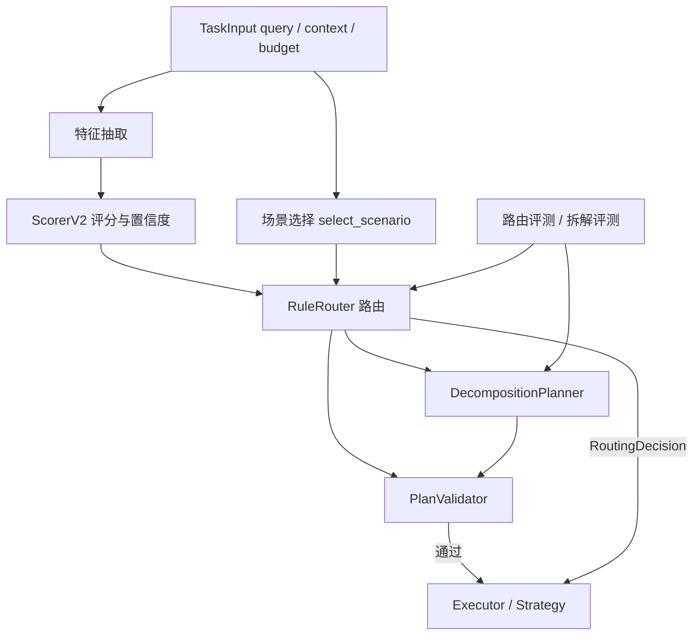

# Orchestra 包 1 技术设计文档：路由与拆解底座

> 文档版本：v1.0
> 状态：已实现；路由评测 89/89，拆解评测 6/6
> 评测日期：2026-08-24（纯规则评测，不调用 LLM）
> 关联代码：`src/orchestra/router.py`、`src/orchestra/planning.py`、`src/orchestra/evals.py`、`src/orchestra/scenarios.py`、`src/orchestra/contracts/routing.py`、`src/orchestra/contracts/subtask.py`
> 关联文档：[docs/08-phase2-plan.md](docs/08-phase2-plan.md)、[docs/09-package2-report.md](docs/09-package2-report.md)、[docs/12-technical-documentation.md](docs/12-technical-documentation.md)

## 1. 背景与目标

P4/P4.5 已经打通 Simple / DAG / React / DAG+React 的 MVP 执行闭环，但路由与拆解仍存在三类问题：

- 复杂度评分只有分数，没有置信度，也没有可解释因子，误路由后难以定位是特征问题、阈值问题还是场景配置问题。
- 全局固定阈值 0.30 无法适配不同部门：人事高频单跳问答、风控多阶段审查、招采流程咨询的复杂度分布差异很大。
- DAG 子任务主要靠场景配置补齐，通用请求拆解缺少工具归属、节点策略与依赖关系校验，拆漏、拆重、环依赖无法被快速发现。

包 1 的目标是建立“可解释、可评测、可校验”的路由与拆解底座：

- ScorerV2 输出分数、置信度、结构化特征与可解释因子。
- RuleRouter 按显式策略、业务场景、通用规则三级决策，场景阈值可配置。
- DecompositionPlanner 提供场景模板、规则规划、LLM 规划三通道，PlanValidator 在 DAG 执行前做静态校验。
- 增加路由与拆解黄金用例，形成可重复执行的回归评测入口。

## 2. 总体架构



路由结果在进入策略执行前统一封装为 `RoutingDecision`，DAG 分支附带已校验的 `subtasks`，执行器不再自行猜测策略与子任务。

## 3. 模块职责

| 模块 | 职责 | 关键依赖 |
| --- | --- | --- |
| `contracts/routing.py` | RoutingFeatures / RoutingDecision 契约 | StrategyType、SubtaskSpec |
| `contracts/subtask.py` | SubtaskSpec 子任务契约 | dataclass |
| `scenarios.py` | 人事/风控/财务/招采场景模板与场景选择 | StrategyType、SubtaskSpec |
| `router.py` | ScorerV2、RuleRouter、路由决策 | scenarios、planning、contracts |
| `planning.py` | DecompositionPlanner、PlanValidator、拆解规则 | LLMService、subtask |
| `evals.py` | 黄金用例、路由评测、拆解评测 | router、planning、executor |
| `tests/test_routing_v2.py` | ScorerV2 / 置信度 / 路由单元测试 | unittest |
| `tests/test_planning.py` | 拆解规划与校验测试 | unittest |
| `tests/test_evals.py` | 评测器冒烟与路由准确率回归 | unittest |

## 4. 复杂度评分 v2

### 4.1 特征抽取

`_extract_features` 从原始请求与上下文中抽取 8 个结构化特征：

| 特征 | 含义 | 抽取方式 |
| --- | --- | --- |
| `text_length` | 请求文本长度 | `len(query.strip())` |
| `clause_count` | 分句数（上限 4） | 按连接词切分后的子句数 |
| `clause_hits` | 多分句标记命中数 | 并且/同时/以及/还有/分别/首先/然后/最后 |
| `step_hits` | 多步骤标记命中数 | 流程/步骤/比较/对比/分析/审查/判断/哪些/怎么办/生成/检查/清单 |
| `tool_hits` | 工具依赖标记命中数 | 合同/文档/制度/报销单/表格/材料 |
| `react_hits` | ReAct 标记命中数 | 调用/工具/检索/审查/核实 |
| `has_department` | 是否带部门上下文 | context.department 非空 |
| `has_workspace_context` | 是否已有工作区产物 | workspace_files / workspace_context / existing_artifacts 等字段非空 |

### 4.2 分数计算

ScorerV2 使用确定性加权规则，分数封顶 0.95，分数越高越倾向复杂策略：

| 信号 | 权重 | 上限 |
| --- | --- | --- |
| 文本长度 > 60 | +0.05 | - |
| 文本长度 > 120 | +0.10 | - |
| 每个分句标记 | +0.12 | 0.36 |
| 每个步骤标记 | +0.12 | 0.36 |
| 每个工具标记 | +0.06 | 0.18 |
| 每个 React 标记 | +0.08 | 0.16 |

最终分数保留两位小数：`score = min(0.95, round(sum(weighted_hits), 2))`。

### 4.3 置信度

置信度用于表达“这个分数是否可信”，与分数解耦。默认低置信复核区间为 `0.25-0.35`：

- 先按分数与区间中点的距离计算基础置信度，远离中点时置信度更高。
- 混合信号会降低置信度：React 标记与步骤标记同时出现 -0.12；分句标记与工具标记同时出现 -0.08；无部门上下文且分句数大于 2 -0.10。
- 已有工作区上下文时 +0.05，表示任务可能复用既有产物，路由更有依据。
- 置信度最终收束在 `0.35-1.00` 之间。

### 4.4 可解释因子

每次评分都会生成 `reasons`，例如：

```text
department_context
clause_markers=2
step_markers=3
react_markers=1
ambiguous_band=0.25-0.35
complexity_score=0.62
scenario_match=risk_contract_review, strategy=dag
```

路由评测可以把每条用例的 `reasons` 落盘，方便定位误路由环节。

## 5. 路由决策

### 5.1 路由优先级

RuleRouter 按以下优先级决策：

1. 显式策略：调用方直接指定 `strategy` 时优先使用；DAG 分支仍会先生成并校验拆解计划。
2. 业务场景：命中场景时使用场景策略与场景阈值。
3. 通用规则：未命中场景时，React 标记优先；否则按复杂度分数与通用阈值 0.30 分流 Simple / DAG。

场景选择按业务优先级处理：风控关键词 > 财务部门上下文 > 其他部门上下文 > 财务/人事/招采关键词，避免“高温补贴”“报销”等跨部门词误路由。

### 5.2 场景阈值

| 场景 | 默认策略 | 阈值 |
| --- | --- | --- |
| 通用请求 | Simple / DAG | 0.30 |
| 人事制度问答 | Simple / React / DAG | 0.30 |
| 风控条款审查 | DAG | 0.25 |
| 财务报销咨询 | Simple | 0.35 |
| 报销单据校验 | DAG | 0.30 |
| 招采流程咨询 | Simple / DAG | 0.30 |

场景阈值从 `DEFAULT_SCENARIO_THRESHOLDS` 与 `.env` 合并读取，`ORCHESTRA_HR_SCENARIO_THRESHOLD` 可单独调人事阈值。

### 5.3 RoutingDecision

路由完成度统一封装为：

| 字段 | 说明 |
| --- | --- |
| `strategy` | 最终选择的策略 |
| `complexity_score` | 复杂度分数 0-0.95 |
| `confidence` | 置信度 0-1 |
| `reasons` | 可解释决策因子 |
| `features` | 结构化特征快照 |
| `budget` | Token 预算透传 |
| `subtasks` | DAG 子任务（已校验） |
| `scenario_id` | 命中的业务场景 |

### 5.4 Simple 升级闭环

Simple 并非无条件执行：

- 路由置信度低于 0.5 时，SimpleStrategy 收到 `routing_decision.confidence` 后直接升级 React，而不是先执行一次注定存疑的调用。
- RAG 场景下检索失败或返回空结果时同样升级 React，让模型换检索词或读取工作区。
- 升级前发出 `ROUTING_ESCALATED` 事件，SSE 调用方能观察到 Simple -> React 的路径变化。

## 6. 拆解规划与校验

### 6.1 SubtaskSpec

每个 DAG 子任务包含以下字段：

| 字段 | 说明 |
| --- | --- |
| `id` | 子任务标识，如 t1/t2/t3 |
| `goal` | 子任务目标 |
| `dependencies` | 前置子任务 id 集合 |
| `tools` | 节点可用工具白名单 |
| `strategy` | `direct` / `react` / `dag` |
| `agent_role` | 部门 Agent 角色，如 contract_analyst / risk_analyst / reviewer |
| `metadata` | 工具参数、规划来源等附加信息 |

### 6.2 场景模板

场景自带 `subtasks` 时直接复用确定模板，执行路径可预期：

- 风控条款审查：t1 条款识别（contract_context）-> t2 规则匹配（react + rag_search / workspace_read）-> t3 审查清单生成。
- 报销单据校验：t1 字段提取 -> t2 政策匹配（react + rag_search / workspace_read）-> t3 修改建议生成。
- 招采流程咨询：t1 定位流程节点 -> t2 输出下一步操作与材料。

### 6.3 规则规划

未命中场景模板时走规则规划：

- 按连接词切分请求，最多生成 4 个子任务；命中“然后/再/接下来”时按串行依赖 `t(i-1) -> t(i)` 连线，否则各节点并行。
- 从场景配置继承部门 Agent 角色与工具白名单，第一个节点优先绑定工具。
- 节点包含 React 标记时声明 `strategy=react`，允许后续 DAG 执行器在该节点复用 React 循环。

### 6.4 LLM 规划与回退

`plan_with_llm` 提供 LLM 拆解通道：

- 系统提示词要求只输出结构化 JSON：`subtasks` + `rationale`。
- 子任务数量限制为 1-4，依赖只能引用已声明 id，工具只能使用框架内置白名单。
- 输出解析失败或未通过 PlanValidator 时自动回退规则规划，并且 rationale 记录“LLM 输出未通过校验”原因。

当前默认路由链使用确定性规则与场景模板保证稳定，LLM 规划作为可选增强通道预留。

### 6.5 PlanValidator

校验器在计划进入 DAG 执行前执行，发现以下任一问题即失败：

- 计划为空。
- 子任务 id 为空或重复。
- 子任务缺少目标。
- 工具名不在内置白名单（`rag_search` / `contract_context` / `workspace_read` / `workspace_list`）。
- 节点策略不在 `direct` / `react` / `dag`。
- Agent 角色未知。
- 依赖引用了不存在的子任务。
- 存在环依赖。
- 计划嵌套深度超过上限 2 层。

`ensure_valid` 校验失败时抛出 `ValueError`，保证执行器永远拿不到未验证的计划。

## 7. 评测体系

### 7.1 评测集

| 评测集 | 数量 | 覆盖 |
| --- | --- | --- |
| `docs/golden/routing-cases.json` | 89 条 | hr 27、risk 12、finance 18、procurement 14、generic 18 |
| `docs/golden/decomposition-cases.json` | 6 条 | 场景模板 3、串行规则 1、并行规则 1、单任务 1 |

### 7.2 路由评测指标

- 准确率：期望策略与期望场景同时命中才算通过。
- 平均置信度：反映规则评分整体可信程度。
- 低置信用例数：置信度低于 0.5 的样本，用于判断是否需要增加复核通道。
- 分部门准确率：识别哪个部门阈值或特征配置需要调优。
- 运行耗时：评测不调用 LLM，适合每次改动后快速回归。

### 7.3 拆解评测指标

- 计划合法率：PlanValidator 通过比例。
- 子任务召回率：期望子任务 id 被覆盖的比例。
- 依赖边 F1：期望依赖边与实际依赖边的重合质量；只统计有期望边的用例，避免无依赖用例拖低指标。
- 规划来源匹配：expected_planner 与实际 planner 一致。

### 7.4 运行方式

```powershell
$env:PYTHONPATH = "src"
python -m orchestra.evals --mode routing
python -m orchestra.evals --mode decomposition
python -m orchestra.evals --mode golden --provider mock
python -m orchestra.evals --mode routing --output data/reports/package1-routing-report.json
```

## 8. 配置项

| 变量 | 默认值 | 说明 |
| --- | --- | --- |
| `ORCHESTRA_ROUTING_GOLDEN_PATH` | `docs/golden/routing-cases.json` | 路由评测集路径 |
| `ORCHESTRA_ROUTING_AMBIGUOUS_BAND` | `0.25,0.35` | 低置信复核区间 |
| `ORCHESTRA_HR_SCENARIO_THRESHOLD` | `0.30` | 人事场景独立阈值 |

配置从 `.env` 读取并写入 `.env.example`，密钥类信息不进入示例配置与文档。

## 9. 测试与验收结果

2026-08-24 实测结果：

### 9.1 路由评测

| 指标 | 结果 |
| --- | --- |
| 总用例 | 89 |
| 通过 | 89 |
| 准确率 | 100% |
| 平均置信度 | 0.8042 |
| 低置信用例 | 14 |
| 分部门准确率 | hr 27/27、risk 12/12、finance 18/18、procurement 14/14、generic 18/18 |
| 运行耗时 | 约 0.019s |

### 9.2 拆解评测

| 指标 | 结果 |
| --- | --- |
| 总用例 | 6 |
| 通过 | 6 |
| 计划合法率 | 6/6 |
| 子任务召回率均值 | 1.0 |
| 依赖边 F1（有边用例） | 1.0 |
| 运行耗时 | 约 0.001s |

单元测试覆盖 ScorerV2、置信度、路由场景、计划校验、Simple 升级与评测器冒烟；第二轮包 2/包 3 完成后全量测试 62 项通过。

## 10. 已知边界与后续演进

- 评分器仍以规则特征为主，语义复杂度与歧义建模不足；`ScorerV2` 通过 `evaluate` 接口隔离，后续可替换为 Embedding 相似度或 LLM 评分。
- 低置信用例 14 条目前只进入升级钩子，后续可增加 LLM 复核通道并写入评测报告，形成人工回流样本。
- 默认路由使用确定性规划，LLM 拆解已具备接口与回退机制，可与真实业务规模验证后再启用。
- 拆解评测集仅 6 条，后续按业务部门持续扩充，与最终答案通过率分开统计。
- 路由评测准确率 100% 是当前黄金集上的纯规则结果，不代表真实线上分布，新增业务用例需要持续回归。

## 11. 相关文档

- [docs/02-technology-selection.md](docs/02-technology-selection.md)：技术选型依据
- [docs/07-dag-react-composition.md](docs/07-dag-react-composition.md)：P4.5 DAG+React 基线
- [docs/08-phase2-plan.md](docs/08-phase2-plan.md)：第二阶段实施规划
- [docs/09-package2-report.md](docs/09-package2-report.md)：包 2 实施报告
- [docs/12-technical-documentation.md](docs/12-technical-documentation.md)：全量技术文档
