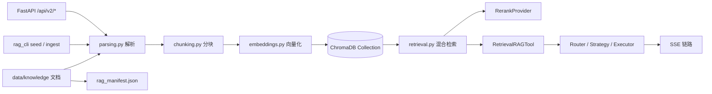

# Orchestra 包 2 技术设计文档：真实 RAG 检索落地

> 文档版本：v1.0
> 状态：已实现并完成真实链路验证；hit@5 / MRR 待黄金检索用例回填
> 更新时间：2026-08-24
> 关联代码：`src/orchestra/rag/`、`src/orchestra/rag_cli.py`、`src/orchestra/tools.py`、`src/orchestra/api.py`、`src/orchestra/config.py`、`src/orchestra/contracts/rag.py`
> 关联文档：[docs/09-package2-report.md](docs/09-package2-report.md)、[docs/08-package1-technical-design.md](docs/08-package1-technical-design.md)、[docs/12-technical-documentation.md](docs/12-technical-documentation.md)

## 1. 背景与目标

P4/P4.5 阶段使用内存知识库 `KeywordRAGTool` 支撑人事/风控原型，关键词命中方式存在明显边界：

- 只能检索预置种子文档，无法接入真实制度文件、合同、报销单等多格式资料。
- 关键词重叠计分缺乏语义召回能力，改写法、口语化表达、跨文档问题召回不稳定。
- 没有部门隔离、文档版本管理和索引清单，知识库不可管理、不可删除、不可审计。

包 2 的目标是把演示级知识库升级为真实 RAG 检索链路：

- 支持 Markdown / TXT / PDF / Word / Excel / PPT 多格式导入。
- 建立文档解析、分块、Embedding、向量入库、清单管理完整管线。
- 向量、关键词、混合三种检索模式，混合检索用 RRF 融合，可选 Rerank 精排。
- 按部门 Collection 隔离，保证人事/风控/财务知识不串域。
- 提供 CLI、FastAPI 与 Agent 工具三层接入，外部服务不可用时自动降级。

## 2. 总体架构



应用默认使用 ChromaDB 本地持久化（`data/chroma`），生产环境可切换 ChromaDB Server；RAG 未启用或配置缺失时保留 `KeywordRAGTool` 兜底，不影响原有编排链路。

## 3. 模块职责

| 模块 | 职责 | 关键依赖 |
| --- | --- | --- |
| `contracts/rag.py` | 知识块、检索结果、索引结果、文档记录契约 | dataclass |
| `rag/parsing.py` | 多格式文档解析与文本清洗 | pypdf / python-docx / openpyxl / python-pptx |
| `rag/chunking.py` | 递归分块与重叠 | 无 |
| `rag/embeddings.py` | OpenAI 兼容 / 本地 Embedding | httpx / sentence-transformers |
| `rag/rerank.py` | MaaS text-rerank 调用 | httpx |
| `rag/vector_store.py` | ChromaDB 本地 / Server 封装 | chromadb |
| `rag/retrieval.py` | BM25 + 向量 RRF、Rerank 精排 | rank-bm25（可选） |
| `rag/ingestion.py` | 文档解析、分块、向量化、入库 | 解析 / 分块 / Embedding / Chroma |
| `rag/manifest.py` | 文档级索引清单与原子写入 | JSON |
| `rag/service.py` | RAG 组件工厂与前置条件检查 | 上述组件 |
| `rag/departments.py` | 部门别名归一化 | 无 |
| `rag_cli.py` | seed / ingest / search / list / delete | argparse / asyncio |
| `tools.py` | RetrievalRAGTool、KeywordRAGTool 与工具注册 | RAG / Workspace |
| `api.py` | `/api/v2/*` 文档与检索接口 | FastAPI |

## 4. 数据模型

### 4.1 KnowledgeChunk

向量库中的最小知识单元：

| 字段 | 说明 |
| --- | --- |
| `chunk_id` | 文档 id + 块序号，如 `{document_id}:0000` |
| `document_id` | 文档级唯一标识 |
| `source` | 相对知识目录的文档来源路径 |
| `department` | 归一化部门标识 |
| `content` | 知识块文本 |
| `title` | 文档标题 |
| `page` | 可选页码，PDF/PPT 溯源使用 |
| `version` | 内容 sha256 前 16 位版本指纹 |
| `metadata` | 附加元数据 |

### 4.2 DocumentRecord

文档级索引记录：`document_id`、`source`、`department`、`title`、`version`、`file_path`、`chunk_count`、`indexed_at`、`status`。

### 4.3 RetrievalResult

检索返回：`query`、`hits`、`mode`、`latency_ms`、`reranked`、`confidence`。`confidence` 取首位命中分数，便于 Agent 与前端判断检索可信度。

## 5. 文档解析与清洗

支持扩展名：

| 类型 | 扩展名 | 解析策略 |
| --- | --- | --- |
| Markdown / 文本 | `.md` / `.markdown` / `.txt` / `.text` | UTF-8-sig -> UTF-8 -> GB18030 顺序读取 |
| PDF | `.pdf` | 按页提取，保留页码 |
| Word | `.docx` | 段落 + 表格，表格行用 `|` 拼接 |
| Excel | `.xlsx` / `.xlsm` | 按工作表输出，空行跳过 |
| PPT | `.pptx` | 按幻灯片提取文本框与表格，保留页码 |

清洗规则统一合并连续空格 / Tab / 全角空格并保留换行，避免 Markdown、表格与中文文本被意外压平。

解析依赖采用延迟导入，未安装对应解析库时不会影响纯文本与 Markdown 链路。

## 6. 分块策略

分块使用轻量递归切分：

- 分隔符优先级：`\n\n` -> `\n` -> `。` -> `；` -> `，` -> 空格 -> 硬切。
- 默认单块目标 512 字符，可经 `.env` 调整。
- 相邻块默认重叠 64 字符，保留跨块上下文；重叠通过追加前一块尾部实现。
- 无可用分隔符时按固定长度硬切，避免超长内容丢失。
- 空文本与只有空白的内容不入库。

选择字符级轻量分块是为了在中小规模企业文档上零重依赖可用；后续可按语义段落升级为模型分块或结构感知分块。

## 7. Embedding Provider

`EmbeddingProvider` 使用异步协议统一两套实现：

| 实现 | 方式 | 适用场景 |
| --- | --- | --- |
| `OpenAICompatEmbeddingProvider` | POST `{base_url}/embeddings`，兼容 DashScope / OpenAI / 其他 OpenAI 兼容服务 | 默认线上链路 |
| `LocalEmbeddingProvider` | sentence-transformers 本地模型，懒加载 | 内网 / 离线部署 |

实现要点：

- OpenAI 兼容接口默认批大小 16，按返回 `index` 恢复原始顺序。
- 本地模型输出做向量归一化；`encode` 放入线程池执行，避免阻塞事件循环。
- `create_embedding_provider` 在缺少 API Key 时返回 None，由工厂整体关闭 RAG。
- 向量维度未配置或为 0 时由服务自动识别。

## 8. 向量存储与部门隔离

`ChromaVectorStore` 支持两种模式：

- 本地持久化：`PersistentClient(path="data/chroma")`，无需容器。
- Server 模式：`HttpClient(host, port=8001)`，用于 Docker 部署与多实例共享。

存储设计：

- Collection 命名 `{prefix}_{department}`，默认 `orchestra_hr` / `orchestra_risk` 等；prefix 可配置。
- 向量距离使用 cosine。
- 每个知识块保存 document_id / source / department / title / version / page 元数据，实现来源可追溯。
- 查询支持按部门分 Collection 召回后再合并、按距离排序；未指定部门时查询全部部门。
- `delete_source` 支持重复导入时先清理旧块，避免同来源新旧内容共存产生重复证据。

## 9. 检索链路

### 9.1 三种模式

| 模式 | 召回方式 |
| --- | --- |
| `vector` | 仅向量近邻召回 |
| `keyword` | 仅 BM25/词元重叠关键词召回 |
| `hybrid` | 向量 + 关键词 RRF 融合，默认模式 |

### 9.2 混合检索

- 向量候选取 `max(top_k * 4, 10)`，保证融合前有足够候选。
- 向量相似度由距离转换为 0-1 分数并做最小最大归一化。
- 关键词使用轻量词元化：英文词 + 中文二元词组；`rank-bm25` 可用时走 BM25Okapi，否则退化为词元重叠计分。
- RRF 常数 `k=60`，向量与关键词各自按名次贡献 `1 / (60 + rank)`，再按融合分排序。
- 融合结果经过 `min_score` 过滤后进入最终 Top-N。

### 9.3 Rerank 精排

`RerankProvider` 调用 MaaS `text-rerank`（默认 `gte-rerank-v2`）：

- 对融合候选前 `rerank_top_n * 4` 条做精排，返回前 `top_n`。
- 按 `relevance_score` 降序重排，保留原始文档元数据。
- Rerank 失败只记录日志并保留 RRF 融合结果，外部服务异常不阻断检索。

### 9.4 置信度与延迟

- `confidence` 取 Top1 命中分数，供 Agent 判断是否继续检索或改用其他工具。
- 返回 `latency_ms`（含向量、融合与 Rerank 全链路耗时），用于可观测与性能回归。

## 10. 文档管理与 Manifest

### 10.1 入库流水线

`IngestionService.index_file` 完整链路：

1. 解析并归一化部门标识。
2. 计算文件内容 sha256 前 16 位作为 `version`，生成 `document_id`。
3. 清理该 source 的旧向量块。
4. 解析文档 -> 分块 -> 补充元数据 -> 批量 Embedding。
5. 校验向量数量与知识块数量一致后写入 ChromaDB。
6. 更新 `rag_manifest.json` 文档记录。

### 10.2 目录导入

- `index_directory` 扫描 `data/knowledge/{department}`，单个文件失败收集到 `errors`，不阻断其余文件。
- `seed_demo` 把内置 P4 演示知识库写入 `data/knowledge` 后再索引，用于演示与验收。

### 10.3 Manifest

- 向量库负责 chunk 级数据，Manifest 负责文档级状态（标题、版本、块数、索引时间）。
- 采用临时文件 + `os.replace` 原子写入，进程中断不会留下半截 JSON。
- 删除文档时先删向量块再删 Manifest 记录，保证两侧一致。

## 11. CLI 与 API 接入

### 11.1 CLI

```powershell
$env:PYTHONPATH = "src"
python -m orchestra.rag_cli seed
python -m orchestra.rag_cli ingest --department hr
python -m orchestra.rag_cli search --query "公司年假有几天" --department hr --top-k 5 --mode hybrid
python -m orchestra.rag_cli list --department hr
python -m orchestra.rag_cli delete --document-id <document_id>
```

RAG 未启用时 CLI 打印可操作提示并以非零码退出。

### 11.2 FastAPI

| 接口 | 说明 |
| --- | --- |
| `POST /api/v2/documents` | 上传单文件 + department，解析并建立索引 |
| `GET /api/v2/documents?department=` | 查询文档清单 |
| `POST /api/v2/documents/ingest` | 扫描知识目录增量索引 |
| `DELETE /api/v2/documents/{document_id}` | 删除文档及向量 |
| `POST /api/v2/knowledge/search` | 执行混合检索，返回命中和置信度 |

### 11.3 Agent 工具接入

- `RetrievalRAGTool`（`rag_search`）把检索结果写入工作区 `rag/{source}`，供后续节点与人工追溯。
- 检索为空或服务异常时返回 `success=false`，Simple 策略自动升级 React 重新换词检索。
- RAG 未启用或依赖缺失时保留 `KeywordRAGTool`，P4/P4.5 演示链路不受影响。

## 12. 配置项

| 变量 | 默认值 | 说明 |
| --- | --- | --- |
| `ORCHESTRA_RAG_ENABLED` | `false` | RAG 总开关 |
| `ORCHESTRA_EMBEDDING_PROVIDER` | `openai` | `openai` / `local` |
| `ORCHESTRA_EMBEDDING_MODEL` | `BAAI/bge-small-zh-v1.5` | Chat/服务端模型名 |
| `ORCHESTRA_EMBEDDING_DIM` | `0` | 向量维度，0 表示自动识别 |
| `ORCHESTRA_EMBEDDING_API_KEY` | 空 | Embedding 密钥 |
| `ORCHESTRA_EMBEDDING_BASE_URL` | `https://api.openai.com/v1` | OpenAI 兼容地址 |
| `ORCHESTRA_CHROMA_PATH` | `data/chroma` | 本地持久化目录 |
| `ORCHESTRA_CHROMA_HOST` / `PORT` | 空 / `8001` | ChromaDB Server 模式 |
| `ORCHESTRA_COLLECTION_PREFIX` | `orchestra` | Collection 前缀 |
| `ORCHESTRA_KNOWLEDGE_SOURCE_DIR` | `data/knowledge` | 原始文档目录 |
| `ORCHESTRA_RETRIEVAL_MODE` | `hybrid` | `hybrid` / `vector` / `keyword` |
| `ORCHESTRA_RETRIEVAL_TOP_K` | `5` | 检索返回条数 |
| `ORCHESTRA_RETRIEVAL_MIN_SCORE` | `0.0` | 最小融合分数 |
| `ORCHESTRA_RERANK_ENABLED` | `false` | 是否启用 Rerank |
| `ORCHESTRA_RERANK_MODEL` | `gte-rerank-v2` | Rerank 模型 |
| `ORCHESTRA_RERANK_API_KEY` | 空 | Rerank 密钥 |
| `ORCHESTRA_RERANK_BASE_URL` | 空 | MaaS Rerank 地址 |
| `ORCHESTRA_RERANK_TOP_N` | `5` | Rerank 返回条数 |
| `ORCHESTRA_RAG_CHUNK_SIZE` | `512` | 单块字符数 |
| `ORCHESTRA_RAG_CHUNK_OVERLAP` | `64` | 相邻块重叠字符数 |
| `ORCHESTRA_RAG_MANIFEST_PATH` | `data/rag_manifest.json` | 文档清单路径 |

API Key 只写入 `.env`，`.gitignore` 忽略，文档与 `.env.example` 不记录密钥。

## 13. 测试与验收

### 13.1 实测结果

2026-08-20 真实链路验证：

- ChromaDB Docker `127.0.0.1:8001` 心跳 200。
- `seed`：hr / risk / finance 共 15 份演示文档全部入库，`errors=[]`。
- 混合检索样例：`"公司年假有几天"`，department=hr，top-k=5，Top1 命中 `hr/leave-policy.md`，`reranked=true`，单次约 736ms。
- 包 2 实施期间全量单元/API 集成测试 55 项通过；包 3 完成后全量测试 62 项通过。

### 13.2 待回填指标

- `hit@5` / `MRR` / 溯源率：需要为 hr / risk / finance 沉淀黄金检索用例后回填。
- ChromaDB 容器重启后的持久化复用需按验收标准复测。

## 14. 已知边界与后续演进

- 当前为 Collection 级数据隔离，多租户权限、字段级加密与细粒度 ACL 尚未落地。
- 轻量分块对长条款类文档可能截断语义，后续可引入结构感知分块或语义分块。
- 检索评测指标占位，需要沉淀部门黄金检索用例并纳入 CI 回归。
- 本地 `sentence-transformers` 为可选路径，依赖未安装时自动跳过 `local` 模式。
- Rerank 已具备 fail-open 能力，后续可把 Rerank 延迟与收益纳入评测对比。

## 15. 相关文档

- [docs/02-technology-selection.md](docs/02-technology-selection.md)：技术选型依据
- [docs/08-package1-technical-design.md](docs/08-package1-technical-design.md)：包 1 技术设计
- [docs/09-package2-report.md](docs/09-package2-report.md)：包 2 实施报告
- [docs/10-package3-report.md](docs/10-package3-report.md)：包 3 实施报告
- [docs/11-package3-technical-design.md](docs/11-package3-technical-design.md)：包 3 技术设计
- [docs/12-technical-documentation.md](docs/12-technical-documentation.md)：全量技术文档
