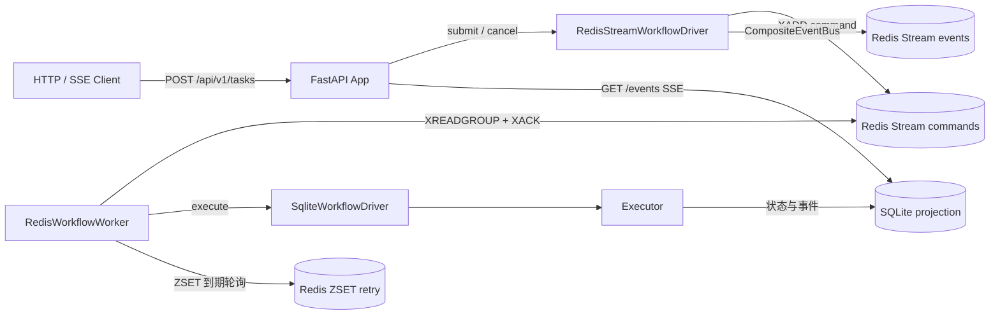

# Orchestra 包 3 技术设计文档：Redis Streams + 自研状态机工作流

> 文档版本：v1.0  
> 状态：已实现，全量测试 62 项通过  
> 关联代码：`src/orchestra/workflow/`、`src/orchestra/store.py`、`src/orchestra/executor.py`、`src/orchestra/api.py`  
> 关联文档：[docs/10-package3-report.md](docs/10-package3-report.md)、[docs/08-phase2-plan.md](docs/08-phase2-plan.md)

## 1. 背景与目标

包 1、包 2 完成后，任务提交到结果返回已经跑通，但任务调度仍是“SQLite + 进程内 asyncio 后台任务”：

- 任务失败只能落终态，没有自动重试与延迟调度。
- 应用重启后没有统一的任务恢复入口。
- 多实例部署时没有命令分发机制，无法横向扩展 Worker。
- 执行过程缺少独立的事件副本，可观测能力依赖 SQLite 单点。

包 3 的目标是把任务调度升级为可重试、可恢复、可观测的工作流引擎，同时保持现有 API、SSE 与业务策略层不破坏。

设计上不引入 Temporal、Celery、Redisson 等重型依赖，选择 Redis Streams 作为命令分发与事件通道，SQLite 作为状态机与读模型，延迟重试队列使用 Redis ZSET 自研。

## 2. 总体架构



同一套 `WorkflowDriver` 接口下有两个实现：

- `SqliteWorkflowDriver`：本地开发、测试、Redis 不可用时的兜底实现，进程内执行。
- `RedisStreamWorkflowDriver`：生产部署实现，任务命令写入 Redis Stream，由 Worker 消费执行。

Redis 负责“分发与补偿”，SQLite 继续负责“状态与历史”。两者通过 `task_id` 关联，任务上下文可以从 SQLite 恢复。

## 3. 模块职责

| 模块 | 职责 | 关键依赖 |
| --- | --- | --- |
| `contracts/workflow.py` | 命令契约、事件类型、执行失败异常 | 无 |
| `workflow/state_machine.py` | 状态定义与合法迁移规则 | `TaskStatus` |
| `workflow/retry.py` | 指数退避 + 抖动策略 | 无 |
| `workflow/retry_scheduler.py` | 延迟重试队列：SQLite 与 Redis ZSET | SQLite / Redis |
| `workflow/event_bus.py` | SQLite、Redis Stream、组合事件总线 | SQLite / Redis |
| `workflow/driver.py` | 统一驱动接口与 SQLite 本地驱动 | Executor、Store |
| `workflow/redis_driver.py` | Redis Stream 驱动：命令流、事件流、延迟队列 | Redis、SqliteWorkflowDriver |
| `workflow/worker.py` | Redis 命令消费 Worker：并发、ACK、补偿 | Redis Stream |
| `store.py` | 任务投影、事件表、重试表、原子迁移 | SQLite |
| `executor.py` | 路由、策略执行、Token 记录、失败上抛 | 路由与策略层 |
| `api.py` | 驱动选择、生命周期、SSE | FastAPI |

## 4. 任务状态机

### 4.1 状态定义

| 状态 | 含义 |
| --- | --- |
| `pending` | 任务已创建，等待路由 |
| `routing` | 正在进行复杂度评分与策略选择 |
| `running` | 策略执行中 |
| `waiting_dependency` | 等待前置依赖完成，预留状态 |
| `retrying` | 失败等待延迟重试 |
| `succeeded` | 执行成功，已生成结果 |
| `failed` | 重试次数耗尽或不可重试错误 |
| `cancelled` | 用户取消 |

### 4.2 合法迁移

| 当前状态 | 允许迁移到 |
| --- | --- |
| `pending` | `routing`、`running`、`retrying`、`failed`、`cancelled` |
| `routing` | `running`、`retrying`、`waiting_dependency`、`failed`、`cancelled` |
| `running` | `succeeded`、`failed`、`retrying`、`waiting_dependency`、`cancelled` |
| `waiting_dependency` | `running`、`retrying`、`failed`、`cancelled` |
| `retrying` | `running`、`retrying`、`failed`、`cancelled` |
| `succeeded` / `failed` / `cancelled` | 无 |

终态不可再流转，重复命令到达时直接返回当前任务记录。

### 4.3 原子迁移与幂等

`store.transition_task` 是包 3 幂等性的核心：

```sql
UPDATE tasks
SET status = ?,
    version = version + 1,
    updated_at = ?,
    attempt_count = attempt_count + 1,
    next_retry_at = ?
WHERE task_id = ?
  AND status IN (expected_statuses)
```

只有任务当前状态命中 `expected_statuses` 时迁移才成功，否则返回 `False`。Redis 消息被重复投递时，第二次执行会因为期望状态不匹配而放弃，避免重复执行与双跑。

`state_machine.py` 以声明式迁移表补充规则校验，供测试和后续集中校验使用。

## 5. 工作流驱动

### 5.1 WorkflowDriver 统一接口

```python
class WorkflowDriver:
    async def submit(self, task_input, *, start=True) -> str: ...
    async def execute(self, task_id) -> dict: ...
    async def retry(self, task_id) -> bool: ...
    async def recover(self) -> int: ...
    async def finish(self, task_id, *, status, result, error) -> dict: ...
    async def cancel(self, task_id) -> bool: ...
    async def start(self) -> None: ...
    async def close(self) -> None: ...
```

业务侧只依赖接口，不感知 SQLite 还是 Redis 实现。

### 5.2 SqliteWorkflowDriver

本地模式流程：

1. `submit` 调用 `executor.create_pending_task` 创建 `pending` 任务。
2. 发布 `workflow.command_accepted` 事件。
3. `start=True` 时通过 `_launch` 放入 asyncio 后台任务执行。
4. `execute` 调用 `executor.run(task_id, finalize_failure=False)`。
5. 执行失败抛出 `TaskExecutionError`，由 `_handle_attempt_failure` 决定进入 `retrying` 或 `failed`。
6. 启动时 `recover` 扫描未完成任务并续跑，`retrying` 任务由调度器到期拉起。

### 5.3 RedisStreamWorkflowDriver

Redis 模式流程：

1. `submit` 在 SQLite 创建任务投影，然后 `XADD` 一条 `submit` 命令。
2. Worker 通过 `XREADGROUP` 消费命令，调用 `execute` 执行。
3. 执行成功后 `XACK` 确认消息。
4. 执行失败进入 `retrying` 时写入 Redis ZSET，到期后由 `retry` 重新 `XADD` 一条 `retry` 命令。
5. `cancel` 发布 `cancel` 命令，Worker 消费后调用 SQLite 驱动取消任务。
6. `recover` 复用 SQLite 驱动的未完成任务扫描与延迟队列到期拉起。

## 6. Redis Streams 设计

### 6.1 Key 命名

默认前缀为 `orchestra`，可通过 `ORCHESTRA_REDIS_STREAM_PREFIX` 修改：

| Key | 用途 |
| --- | --- |
| `orchestra:task:commands` | Worker 消费的命令流 |
| `orchestra:task:events` | 可观测事件流副本 |
| `orchestra:task:retry` | 延迟重试 ZSET |

### 6.2 命令消息格式

`XADD orchestra:task:commands *` 写入扁平字段：

```text
kind: submit | retry | cancel | recover
task_id: <task_id>
version: 0
payload: <JSON string>
```

### 6.3 事件消息格式

`XADD orchestra:task:events *` 写入：

```text
task_id: <task_id>
event_type: workflow.command_accepted | workflow.task_retry_scheduled | ...
payload: <JSON string>
occurred_at: <ISO 8601 UTC>
```

### 6.4 消费组

驱动启动时对命令流和事件流创建消费组 `orchestra-workers`：

- 命令流消费组从 `0` 开始，保留历史命令，Worker 可从头消费。
- 事件流消费组从 `$` 开始，只接收新事件，供外部可观测消费者使用。

消费组允许多个 Worker 实例共享命令流，同一条命令只会投递给组内一个消费者。

### 6.5 消费语义

Worker 主循环：

```text
while running:
    messages = XREADGROUP GROUP <group> <consumer> STREAMS <commands> > COUNT N
    for message in messages:
        并发额度内执行命令
        成功后 XACK
    执行 XAUTOCLAIM 认领超时未 ACK 消息
    无消息时短轮询等待
```

当前实现为保证 fakeredis 兼容，`XREADGROUP` 使用非阻塞模式加 50ms 轮询；真实 Redis 下不影响正确性，后续可切换为阻塞读降低空转。

消息确认语义为 at-least-once：

- Worker 执行成功后才 `XACK`。
- 执行异常不 ACK，消息留在 Pending Entries List。
- 空闲超过 `claim_idle_ms` 的消息由 `XAUTOCLAIM` 补偿给其他 Worker。
- SQLite 状态机保证重复执行幂等。

## 7. 延迟重试

Redis Streams 不原生提供延迟队列，因此使用 Redis ZSET 自研。

### 7.1 RetryPolicy

```text
delay(attempt) = min(base * 2 ^ (attempt - 1), max_delay) + jitter
```

`jitter` 在 `[-jitter_ms, +jitter_ms]` 内随机，最终值不小于 0。

示例（`base=1000`、`max=60000`、`jitter=200`）：

| 第 N 次重试 | 基准延迟 |
| --- | --- |
| 1 | 约 1000 ms |
| 2 | 约 2000 ms |
| 3 | 约 4000 ms |
| 4 | 约 8000 ms |

### 7.2 RetryScheduler 接口

```python
class RetryScheduler:
    async def schedule(self, key: str, delay_ms: int) -> None: ...
    async def cancel(self, key: str) -> bool: ...
    async def pop_due(self, limit: int = 100) -> list[str]: ...
```

实现：

- `SqliteRetryScheduler`：写入 `retry_queue` 表，适合本地开发和 SQLite 模式。
- `RedisZsetRetryScheduler`：写入 `orchestra:task:retry` ZSET，适合生产 Redis 模式。

### 7.3 Lua 原子弹出

真实 Redis 使用 Lua 脚本原子完成“查询到期 + 删除”：

```lua
local now = tonumber(ARGV[1])
local limit = tonumber(ARGV[2])
local members = redis.call('ZRANGEBYSCORE', KEYS[1], '-inf', now, 'LIMIT', 0, limit)
if #members > 0 then
  redis.call('ZREM', KEYS[1], unpack(members))
end
return members
```

### 7.4 降级路径

`RedisZsetRetryScheduler` 注册 Lua 脚本失败或脚本执行失败时，自动降级为：

```text
ZRANGEBYSCORE key 0 now LIMIT 0 limit
ZREM key member1 member2 ...
```

降级路径仍能完成功能，但不再保证单次调用的原子性；正常生产 Redis 走 Lua 路径。

## 8. 事件总线与可观测性

### 8.1 总线实现

- `SqliteEventBus`：写入 `task_events` 表，SSE 按自增 `id` 增量读取。
- `RedisStreamEventBus`：写入 Redis 事件流，保留可观测副本。
- `CompositeEventBus`：先写 SQLite，再尽力写 Redis；Redis 不可用时只告警日志，不阻断任务状态流转。

### 8.2 SSE 读模型

`GET /api/v1/tasks/{task_id}/events` 仍从 SQLite 增量读取：

```text
last_id = 0
loop:
    events = store.list_events(task_id, after_id=last_id)
    推送新事件，更新 last_id
    任务终态且无新事件时断开
```

Redis 事件流作为额外可观测副本，不依赖它保证 SSE 可用。

## 9. 数据模型

### 9.1 tasks 表增量字段

| 字段 | 类型 | 说明 |
| --- | --- | --- |
| `version` | INTEGER | 状态版本号，每次迁移 +1 |
| `attempt_count` | INTEGER | 已失败尝试次数 |
| `next_retry_at` | TEXT | 下次重试时间，ISO 8601 |

旧库通过 `ALTER TABLE tasks ADD COLUMN ...` 增量迁移，不影响已有数据。

### 9.2 retry_queue 表

| 字段 | 类型 | 说明 |
| --- | --- | --- |
| `key` | TEXT PRIMARY KEY | 任务主键 |
| `due_at` | INTEGER | 到期毫秒时间戳 |

索引 `idx_retry_due(due_at)` 用于到期查询。

### 9.3 task_events 表

沿用现有自增 `id`、`task_id`、`event_type`、`payload_json`、`occurred_at`，SSE 兼容。

## 10. 配置项

| 环境变量 | 默认值 | 说明 |
| --- | --- | --- |
| `ORCHESTRA_WORKFLOW_DRIVER` | `sqlite` | `sqlite` 或 `redis` |
| `ORCHESTRA_REDIS_URL` | `redis://127.0.0.1:6379/0` | Redis 连接地址 |
| `ORCHESTRA_REDIS_STREAM_PREFIX` | `orchestra` | Stream 与 ZSET Key 前缀 |
| `ORCHESTRA_REDIS_CONSUMER_GROUP` | `orchestra-workers` | 消费组名称 |
| `ORCHESTRA_WORKER_CONCURRENCY` | `4` | Worker 并发消费额度 |
| `ORCHESTRA_RETRY_MAX_ATTEMPTS` | `3` | 最大尝试次数 |
| `ORCHESTRA_RETRY_BASE_DELAY_MS` | `1000` | 首次重试延迟 |
| `ORCHESTRA_RETRY_MAX_DELAY_MS` | `60000` | 重试延迟上限 |
| `ORCHESTRA_RETRY_JITTER_MS` | `200` | 随机抖动范围 |

依赖配置：

- `requirements.txt`：新增 `redis>=5.0`。
- `requirements-dev.txt`：新增 `fakeredis>=2.20`。
- `pyproject.toml`：`workflow` extras 改为 `redis>=5.0`，`dev` extras 增加 fakeredis。

## 11. API 集成

### 11.1 创建任务

`POST /api/v1/tasks` 返回 `202` 与 `task_id`，随后：

- SQLite 模式：驱动后台执行。
- Redis 模式：写入命令流，由 Worker 消费执行。

### 11.2 查询任务

`GET /api/v1/tasks/{task_id}` 返回：

```text
status
result / error
version
attempt_count
next_retry_at
token_usage
duration_ms
```

### 11.3 取消任务

`DELETE /api/v1/tasks/{task_id}`：

- 已终止任务返回 `409`。
- Redis 模式发布 `cancel` 命令，Worker 消费后执行取消。

### 11.4 失败回退

`api.py` 的 lifespan 中，Redis 模式启动失败时自动回退到 `SqliteWorkflowDriver`，并输出 warning 日志。本地未部署 Redis 不会阻塞应用启动。

## 12. 部署与运维

### 12.1 启动 Redis

项目已提供编排文件：

```powershell
docker-compose -f docker/docker-compose.yml up -d
docker-compose -f docker/docker-compose.yml ps
```

验证：

```powershell
docker exec orchestra-redis redis-cli ping
```

预期输出 `PONG`。Redis 容器开启 AOF 持久化，数据卷为 `orchestra_redis`。

### 12.2 切换 Redis 工作流

在 `.env` 中配置：

```env
ORCHESTRA_WORKFLOW_DRIVER=redis
ORCHESTRA_REDIS_URL=redis://127.0.0.1:6379/0
ORCHESTRA_REDIS_STREAM_PREFIX=orchestra
ORCHESTRA_REDIS_CONSUMER_GROUP=orchestra-workers
ORCHESTRA_WORKER_CONCURRENCY=4
ORCHESTRA_RETRY_MAX_ATTEMPTS=3
ORCHESTRA_RETRY_BASE_DELAY_MS=1000
ORCHESTRA_RETRY_MAX_DELAY_MS=60000
ORCHESTRA_RETRY_JITTER_MS=200
```

启动应用：

```powershell
python -m orchestra.main
```

### 12.3 运维检查命令

```powershell
# 查看消费组与 Pending 数量
docker exec orchestra-redis redis-cli XINFO GROUPS orchestra:task:commands

# 查看命令流长度
docker exec orchestra-redis redis-cli XLEN orchestra:task:commands

# 查看事件流长度
docker exec orchestra-redis redis-cli XLEN orchestra:task:events

# 查看延迟队列
docker exec orchestra-redis redis-cli ZRANGE orchestra:task:retry 0 -1 WITHSCORES
```

## 13. 故障场景与恢复

| 故障场景 | 恢复机制 |
| --- | --- |
| Worker 执行失败 | 不 ACK，消息留在 Pending，后续重试或补偿 |
| Worker 崩溃 | `XAUTOCLAIM` 认领超时消息 |
| 应用进程重启 | 启动时扫描 SQLite 未完成任务并续跑 |
| 重试任务到期 | ZSET 轮询弹出，重新发布 `retry` 命令 |
| Redis 暂时不可用 | API 启动回退 SQLite 驱动；事件流写入失败不阻断任务 |
| 重复命令投递 | SQLite 状态机期望状态校验保证幂等 |

## 14. 测试与验收

全量测试命令：

```powershell
$env:PYTHONDONTWRITEBYTECODE='1'
$env:PYTHONPATH='<项目根目录>\src'
<conda 环境 python> -m unittest discover -s tests -v
```

验收结果：

- 全量 62 项测试通过，其中包 3 新增 7 项。
- 覆盖状态机、RetryPolicy、SQLite 重试/恢复、Redis ZSET 延迟队列、Redis Stream 事件总线、Worker 命令消费闭环。
- 真实 Redis 端到端验收：任务状态 `succeeded`，消费组 Pending 为 `0`，命令已 XACK，事件流正常写入。

fakeredis 兼容说明：

- fakeredis 不支持 Lua 脚本时，ZSET 调度器自动降级为 `ZRANGEBYSCORE + ZREM`。
- fakeredis 对阻塞 `XREADGROUP` 支持不完整，Worker 使用非阻塞读 + 短轮询。

## 15. 已知限制与后续演进

1. Redis Streams 是 at-least-once 语义，最终一致性依赖 SQLite 状态机；后续可增加去重消息 ID 与死信队列。
2. 当前命令消费失败只留 Pending 等待补偿，尚未落地独立 DLQ；可新增失败计数达到阈值后转入死信流。
3. SQLite 驱动面向单实例；多实例横向扩展应使用 Redis 模式。
4. `state_machine.py` 的迁移规则是声明式契约，实际迁移由 `transition_task` 的 `expected_statuses` 约束；后续可在 Store 层统一强制校验。
5. `retry` 已具备接口能力，但尚未开放手动重试 HTTP 端点，可后续补充。
6. 事件流消费组已创建，但当前 Worker 只消费命令流；事件流可用于后续监控、审计或数据管道。
