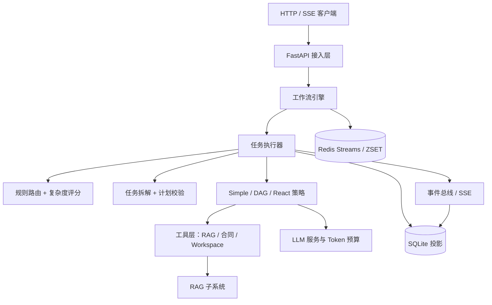

# Orchestra 全量技术文档

> 文档版本：v1.1
> 文档日期：2026-08-25
> 适用项目：Orchestra 多智能体编排框架
> 关联仓库：`D:\实习记录\组内项目\Orchestra`

## 1. 项目概述

Orchestra 是一套面向公司内部场景的多智能体编排框架。它借鉴 Shannon 开源框架的分层架构思想，结合业务访谈与原型验证，落地了从任务提交、复杂度评分、策略路由、任务拆解、多策略执行、RAG 检索、Token 预算控制到工作流持久化与可观测性的完整闭环。

项目的核心目标是让不同部门的高频业务问题共享同一套编排底座：

- 统一接收任务，按复杂度、部门场景与可用工具自动选择执行策略。
- 支持 Simple、React、DAG，并允许 DAG 节点内嵌 React，形成组合编排。
- 支持真实 RAG 检索、Rerank 精排、会话工作区与多 Agent 中间产物共享。
- 支持任务重试、崩溃恢复、SSE 全链路可观测与多实例 Worker 消费。
- 用 Mock LLM 保证开发、测试与演示不依赖真实 API Key。

### 1.1 阶段交付状态

| 阶段 | 交付物 | 状态 |
| --- | --- | --- |
| P0 方案设计 | 多智能体编排框架实现方案 | 已完成 |
| P1 调研设计 | Shannon 调研、技术选型、架构/API/场景文档、核心契约 | 已完成 |
| P2 最小闭环 | FastAPI、规则路由、Simple/DAG、SQLite、SSE | 已完成 |
| P3 能力增强 | React 工具循环、RAG 工具、Workspace、Token 预算 | 已完成 |
| P4 原型验证 | 人事制度问答、风控条款审查、30 条黄金用例评测器 | 已完成，量化指标待验收回填 |
| P4.5 组合编排 | DAG + React 正交化、节点级策略、Simple+RAG/React 路由 | 已完成 |
| 第二阶段·包 1 | 路由评测底座、可解释评分、拆解计划校验 | 已实现，路由评测 89/89 |
| 第二阶段·包 2 | 真实 RAG 落地：ChromaDB、混合检索、Rerank、RAG CLI/API | 已实现并完成真实链路验证 |
| 第二阶段·包 3 | Redis Streams + 自研状态机工作流引擎 | 已实现，全量测试 62 项通过 |

## 2. 技术栈与关键决策

| 领域 | 技术选择 | 说明 |
| --- | --- | --- |
| 语言 | Python 3.11+ | 异步生态成熟，适合 LLM 与工具编排 |
| API | FastAPI + Uvicorn | REST + SSE，自动生成 OpenAPI 文档 |
| LLM | Mock / OpenAI 兼容 Provider | 支持 OpenAI、DashScope 等兼容服务，预留本地模型 |
| 向量库 | ChromaDB | 本地 PersistentClient 或 Docker Server，按部门分 Collection |
| 检索 | BM25 + 向量 RRF，Rerank 精排 | 支持 hybrid / vector / keyword |
| 存储 | SQLite | 任务、事件、Token 用量、重试队列 |
| 工作流 | Redis Streams + 自研状态机 | Redis 未部署时自动回退 SQLite 驱动 |
| 延迟重试 | Redis ZSET + Lua | Streams 不原生支持延迟队列，使用 ZSET 自研 |
| 基础设施部署 | Docker Compose | Redis 7.4、ChromaDB Server |
| 测试 | unittest | 覆盖 API、路由、规划、策略、RAG、工作流、Workspace |

关键决策：

- 不直接部署 Shannon，只借鉴其 Router -> Strategy Workflow -> Pattern -> Activities 的分层思想。
- 不引入 Temporal，最终采用 Redis Streams + 自研状态机，保留 `WorkflowDriver` 接口便于后续替换。
- RAG 前端不重复建设检索中台，先以 ChromaDB 独立落地内部知识检索。
- 默认使用 SQLite 与 Mock LLM，保证本地零配置可启动。

## 3. 总体架构




### 3.1 分层职责

| 层级 | 组件 | 职责 |
| --- | --- | --- |
| 接入层 | `api.py`、SSE | 接收任务、查询状态、取消、订阅事件、RAG 管理 |
| 编排层 | `router.py`、`planning.py` | 特征抽取、复杂度评分、场景路由、拆解计划、计划校验 |
| 执行层 | `executor.py` | 路由决策落地、策略选择、状态迁移、Token 记录 |
| 策略层 | `strategies/` | Simple 单次回答、React 工具循环、DAG 并行/串行调度 |
| 工具层 | `tools.py`、`workspace/` | RAG 检索、合同上下文、工作区读/写/列表 |
| 基础设施 | `llm.py`、`budget.py`、`store.py`、`workflow/` | LLM 调用、预算控制、持久化、工作流驱动 |
| 检索层 | `rag/` | 文档解析、分块、Embedding、ChromaDB、混合检索、Rerank |
| 可观测 | 事件表、SSE、Redis 事件流 | 任务时间线、工具调用、Token 用量、状态迁移 |

## 4. 目录结构与模块索引

| 路径 | 模块 | 主要职责 |
| --- | --- | --- |
| `src/orchestra/api.py` | FastAPI 服务 | 任务、SSE、Workspace、RAG v2、场景接口 |
| `src/orchestra/executor.py` | 执行器 | 任务创建、路由、执行、状态迁移、事件输出 |
| `src/orchestra/router.py` | 路由 | 特征评分、置信度、场景与通用策略选择 |
| `src/orchestra/planning.py` | 规划 | 规则/场景/LLM 拆解与计划校验 |
| `src/orchestra/scenarios.py` | 场景 | 人事、风控、财务、招采场景模板 |
| `src/orchestra/store.py` | 存储 | 任务、事件、Token、重试队列、原子迁移 |
| `src/orchestra/llm.py` | LLM | Mock / OpenAI 兼容 Provider 与降级 |
| `src/orchestra/budget.py` | 预算 | Token 限额、动态 max_tokens、模型降级 |
| `src/orchestra/tools.py` | 工具 | RAG、合同、Workspace 工具与注册表 |
| `src/orchestra/workspace/` | 工作区 | 本地文件与内存实现 |
| `src/orchestra/rag/` | RAG | 解析、分块、Embedding、ChromaDB、检索、Rerank、清单 |
| `src/orchestra/evals.py` | 评测 | 黄金用例、路由评测、拆解评测 |
| `src/orchestra/workflow/` | 工作流引擎 | 状态机、驱动、事件总线、RetryScheduler、Worker |
| `src/orchestra/contracts/` | 契约 | 任务、路由、策略、事件、RAG、工作流数据结构 |
| `tests/` | 测试 | 单测与 API 集成测试 |
| `docs/` | 文档 | 调研、架构、API、场景、实施报告与技术文档 |
| `docker/` | 部署 | Redis / ChromaDB Docker Compose |

## 5. 核心数据契约

### 5.1 任务状态

| 状态 | 含义 |
| --- | --- |
| `pending` | 已提交，等待路由 |
| `routing` | 正在评分与选择策略 |
| `running` | 策略执行中 |
| `waiting_dependency` | 等待前置依赖，预留 |
| `retrying` | 失败重试等待中 |
| `succeeded` | 成功 |
| `failed` | 失败 |
| `cancelled` | 取消 |

### 5.2 TaskInput

| 字段 | 说明 |
| --- | --- |
| `query` | 用户问题 |
| `session_id` | 会话隔离标识 |
| `user_id` | 用户标识，默认 anonymous |
| `context` | 部门、角色、工作区等上下文 |
| `strategy` | 显式策略；None 为自动路由 |
| `budget` | Token 预算 |
| `max_iterations` | React 最大迭代次数 |
| `workspace_enabled` | 是否启用工作区 |
| `metadata` | 附加元数据 |

### 5.3 RoutingDecision

| 字段 | 说明 |
| --- | --- |
| `strategy` | simple / dag / react / swarm |
| `complexity_score` | 复杂度评分 0~0.95 |
| `confidence` | 路由置信度 0~1 |
| `reasons` | 可解释决策因子 |
| `features` | 结构化路由特征 |
| `budget` | 预算 |
| `subtasks` | DAG 子任务 |
| `scenario_id` | 命中场景 |

### 5.4 SubtaskSpec

| 字段 | 说明 |
| --- | --- |
| `id` | 节点 ID，如 t1/t2/t3 |
| `goal` | 节点目标 |
| `dependencies` | 前置节点 ID |
| `tools` | 节点可用工具白名单 |
| `strategy` | direct / react / dag |
| `agent_role` | generalist、contract_analyst、risk_analyst 等 |
| `metadata` | 工具参数、嵌套子任务等 |

### 5.5 策略契约

- `StrategyType`：simple / dag / react / swarm。
- `StrategyContext`：任务 ID、查询、会话、工作区、预算、子任务、事件回调。
- `StrategyResult`：输出、工具调用列表、Token 用量、错误。
- `BaseStrategy`：`name` + `execute(context)`。

### 5.6 事件类型

`task.created`、`task.routed`、`strategy.started`、`routing.escalated`、`agent.started`、`agent.completed`、`tool.called`、`tool.completed`、`workspace.updated`、`token.updated`、`budget.fallback`、`task.completed`、`task.failed`、`task.cancelled`。

### 5.7 工作流契约

- `WorkflowCommandKind`：submit / retry / cancel / recover。
- `WorkflowEventType`：command_accepted、task_claimed、task_retry_scheduled、retries_exhausted 等。
- `WorkflowCommand`：kind + task_id + version + payload。
- `TaskExecutionError`：一次执行失败，交由驱动决定重试或终态。

## 6. 路由层

### 6.1 特征抽取

`router.py` 从查询与上下文中抽取：

- `text_length`：文本长度。
- `clause_count`：按连接词切分的子句数。
- `clause_hits`：并且、同时、然后等连接词命中数。
- `step_hits`：流程、审查、清单、判断等多步标记命中数。
- `tool_hits`：合同、文档、制度、报销单等依赖工具标记。
- `react_hits`：调用、检索、核实等 React 标记。
- `has_department`：是否带部门上下文。
- `has_workspace_context`：是否引用既有工作区产物。

### 6.2 ScorerV2 复杂度评分

评分逻辑：

```text
长文本加分：>60 字符 +0.05，>120 字符 +0.10
连接词加分：clause_hits * 0.12，上限 0.36
多步加分：step_hits * 0.12，上限 0.36
工具加分：tool_hits * 0.06，上限 0.18
React 加分：react_hits * 0.08，上限 0.16
总分封顶 0.95
```

置信度默认随特征充分度提升；分数落入 `0.25~0.35` 低置信区间时置信度降低。

### 6.3 路由优先级

1. 用户显式指定 `strategy`。
2. 命中业务场景：
   - HR 高频单跳默认 Simple + RAG，复杂或显式检索升级 React。
   - 风控默认 DAG，节点已内置 react。
   - 财务默认 Simple，单据校验升级 DAG。
   - 招采流程问题可升级 DAG。
3. 未命中场景：
   - 含 React 标记走 React。
   - 复杂分数高于阈值走 DAG。
   - 其余走 Simple。
4. 低置信 Simple 决策由 SimpleStrategy 执行时升级 React。

### 6.4 场景阈值

| 场景 | 默认阈值 |
| --- | --- |
| HR 人事制度问答 | 0.30 |
| 风控条款审查 | 0.25 |
| 财务报销政策问答 | 0.35 |
| 报销单据校验 | 0.30 |
| 招采流程咨询 | 0.30 |

## 7. 任务拆解与计划校验

### 7.1 DecompositionPlanner

三种规划来源：

| 来源 | 行为 |
| --- | --- |
| scenario | 场景配置自带 subtasks 时直接使用模板 |
| rule | 按连接词切分子句，生成依赖边、工具与节点策略 |
| llm | 调用 LLM 输出 JSON 计划，校验失败自动回退 rule |

规则规划示例：

```text
查询：先检索制度，再核对申请流程
拆分：t1 检索制度；t2 核对申请流程，依赖 t1
```

### 7.2 PlanValidator 校验规则

- 计划不能为空。
- 子任务 ID 不能重复、不能为空。
- 子任务目标不能为空。
- 工具必须属于 `rag_search / contract_context / workspace_read / workspace_list`。
- 节点策略必须属于 `direct / react / dag`。
- 角色必须属于已知角色清单。
- 依赖必须存在。
- 不允许循环依赖与不可达依赖。
- 递归 DAG 深度不超过 2 层。

## 8. 执行器与策略

### 8.1 Executor 执行流程

```text
create_pending_task -> PENDING
route -> ROUTING
选择策略，注入 StrategyContext
策略执行 -> RUNNING
记录 Token、写入 Workspace、发布事件
成功 -> SUCCEEDED
失败 -> 抛 TaskExecutionError，由工作流驱动重试或 FAILED
```

包 3 之后，`Executor.submit` 拆分为 `create_pending_task` + `launch`，失败模式不再直接落终态，而是把决策权交给工作流驱动。

### 8.2 SimpleStrategy

- 单次 LLM 调用直接回答。
- HR / 财务场景默认先调用 `rag_search`。
- 检索失败、无命中或路由低置信时发出 `routing.escalated` 并升级 React。
- 结果写入 `answer.md`。

### 8.3 ReactStrategy

执行循环：

1. 模型输出最终答案或 JSON 工具调用。
2. 解析工具调用，按节点白名单执行工具。
3. 工具输出写入 Workspace，事件带 subtask_id / agent_role。
4. 工具结果作为观察追加对话历史，继续迭代。
5. 达到最大迭代次数时基于已有观察生成兜底结论。

### 8.4 DAGStrategy

调度逻辑：

- 按依赖关系分批，每批只执行已就绪节点。
- 就绪节点用 `asyncio.gather` 并发执行，受 `max_parallel` 信号量限制。
- direct 节点：先执行声明工具，再单次 LLM 完成节点。
- react 节点：复用 React 节点循环。
- dag 节点：递归执行嵌套 DAG，深度限制 2 层。
- 节点结果写入 `subtasks/{id}.md`，依赖节点可复用前序结果。
- 全部完成后再调用一次 LLM 汇总最终答案。

### 8.5 DAG + React 组合编排

DAG 负责执行拓扑，React 负责单节点推理模式。当前风控场景：

| 节点 | 节点策略 | 工具 | 说明 |
| --- | --- | --- | --- |
| t1 条款识别 | direct | contract_context | 提取合同付款、验收、违约金、争议解决条款 |
| t2 规则匹配 | react | rag_search, workspace_read | 可多次检索、调整关键词 |
| t3 审查清单 | direct | 无 | 生成风险等级、依据与处置建议 |

## 9. Token 预算与 LLM

### 9.1 LLM Provider

- `MockLLMProvider`：确定性输出，支持模拟 RAG 工具调用，用于测试与演示。
- `OpenAICompatProvider`：兼容 OpenAI / DashScope 等 `/chat/completions` 协议。
- `LLMService`：主模型失败时自动降级备用模型，只重试一次。

### 9.2 TokenBudgetTracker

- 无预算时不限制，`remaining` 返回极大值。
- 每次调用的 max_tokens 取单 Agent 上限与剩余额度较小值。
- 剩余额度低于总预算 25% 时切换到备用模型。
- 调用前调用 `ensure_available`，不足时抛 `BudgetExceededError`。
- 策略执行结束后 Token 用量写入 `token_usage` 表。

## 10. 工具与工作区

### 10.1 工具清单

| 工具 | 名称 | 说明 |
| --- | --- | --- |
| RAG 检索 | `rag_search` | 内置关键词检索或真实向量混合检索 |
| 合同上下文 | `contract_context` | 提取演示合同/工作区合同的四类条款 |
| 工作区读取 | `workspace_read` | 读取会话文件 |
| 工作区列表 | `workspace_list` | 列出全部会话文件 |

`ToolRegistry` 统一注册与查询，为 LLM 输出工具 schema。未启用真实 RAG 时自动注册 `KeywordRAGTool`，不影响 Mock 链路。

### 10.2 Workspace

- 默认 `LocalWorkspace`，根目录 `data/workspaces/{session_id}`。
- 内存实现在测试中使用。
- 关键文件：
  - `answer.md`：最终答案。
  - `rag/`：检索来源文档。
  - `contracts/`：合同快照。
  - `subtasks/{id}.md`：DAG 节点结果。
  - `dag/{id}/`：节点工具输出、React 轨迹。
  - `react/trace.md`：顶层 React 轨迹。

## 11. RAG 子系统

### 11.1 索引链路

```text
data/knowledge/{department}
  -> parse_document
  -> split_text
  -> EmbeddingProvider
  -> ChromaVectorStore.upsert
  -> ManifestStore
```

### 11.2 文档解析

支持 Markdown、TXT、PDF、Word、Excel、PPT。PDF 和 PPT 保留页码元数据，Excel 按工作表输出，Word 段落与表格统一提取。

### 11.3 分块

- 递归分隔符：段落、换行、句号、分号、逗号、空格。
- 默认 `chunk_size=512`，`chunk_overlap=64`。
- 超长块降级硬切，重叠保留相邻块上下文。

### 11.4 Embedding

- OpenAI 兼容接口，支持 DashScope 等，批量大小 16。
- 本地 `sentence-transformers` 为可选离线路径。

### 11.5 ChromaVectorStore

- 按部门分 Collection，命名 `orchestra_{department}`。
- 支持本地 PersistentClient 与 HttpClient。
- 记录 document_id、source、department、title、version、page。

### 11.6 检索

- vector：仅向量召回，距离转相似度并归一化。
- keyword：BM25，未安装 rank-bm25 时退化为词元重叠计分。
- hybrid：向量与 BM25 用 RRF（k=60）融合。
- Rerank：MaaS text-rerank 精排，失败不阻断检索。
- 响应包含 mode、latency_ms、reranked、confidence。

### 11.7 文档清单

`data/rag_manifest.json` 保存文档级记录，使用原子替换写入。重复导入时按 sha256 版本指纹先删旧块再写新块。

## 12. 工作流引擎

详细设计见 [docs/11-package3-technical-design.md](docs/11-package3-technical-design.md)，本节为全量摘要。

### 12.1 状态机

```text
PENDING -> ROUTING -> RUNNING -> SUCCEEDED
                  |        |
                  +-> WAITING_DEPENDENCY / RETRYING -> RUNNING
                  +-> FAILED / CANCELLED
```

### 12.2 WorkflowDriver

```text
submit / execute / retry / recover / finish / cancel / start / close
```

- `SqliteWorkflowDriver`：本地默认驱动，进程内 asyncio 调度。
- `RedisStreamWorkflowDriver`：生产驱动，命令写入 Redis Stream，由 Worker 消费。

### 12.3 Redis Streams

| Key | 用途 |
| --- | --- |
| `orchestra:task:commands` | 命令流 |
| `orchestra:task:events` | 事件流副本 |
| `orchestra:task:retry` | 延迟重试 ZSET |

Worker 使用 `XREADGROUP` 消费、成功后 `XACK`，崩溃消息通过 `XAUTOCLAIM` 补偿。SQLite 的原子状态迁移保证重复消费幂等。

### 12.4 延迟重试

- 指数退避：`min(base * 2^(attempt-1), max_delay) + jitter`。
- SQLite 模式使用 `retry_queue` 表。
- Redis 模式使用 ZSET + Lua 原子弹出，Lua 不可用时降级 `ZRANGEBYSCORE + ZREM`。

### 12.5 事件总线

- `SqliteEventBus`：SSE 读模型。
- `RedisStreamEventBus`：Redis 可观测副本。
- `CompositeEventBus`：先写 SQLite，Redis 失败只告警不阻断。

## 13. 存储层

### 13.1 tasks 表

核心字段：

```text
task_id, query, session_id, user_id, context_json, strategy,
status, result_json, error, duration_ms, budget_json,
max_iterations, workspace_enabled, metadata_json,
created_at, updated_at,
version, attempt_count, next_retry_at
```

`version` 每次迁移 +1，`attempt_count` 记录失败次数，`next_retry_at` 记录下次重试时间。旧库通过 `ALTER TABLE` 增量迁移。

### 13.2 task_events 表

自增 `id` + `task_id` + `event_type` + `payload_json` + `occurred_at`，SSE 按 `id > last_id` 增量读取。

### 13.3 token_usage 表

记录每次 LLM 调用的 agent_id、input/output tokens、model、created_at。

### 13.4 retry_queue 表

`key` + `due_at`，`due_at` 为毫秒时间戳，索引用于到期弹出。

## 14. REST 与 SSE API

### 14.1 接口清单

| 方法 | 路径 | 说明 |
| --- | --- | --- |
| GET | `/` | 服务信息 |
| GET | `/healthz` | 健康检查 |
| POST | `/api/v1/tasks` | 提交任务，202 |
| GET | `/api/v1/tasks/{task_id}` | 查询任务 |
| DELETE | `/api/v1/tasks/{task_id}` | 取消任务 |
| GET | `/api/v1/tasks/{task_id}/events` | SSE 事件流 |
| GET | `/api/v1/scenarios` | 场景清单 |
| GET | `/api/v1/sessions/{session_id}/workspace` | 列出工作区 |
| GET | `/api/v1/sessions/{session_id}/workspace/files/{path}` | 读取工作区文件 |
| POST | `/api/v2/documents` | 上传并索引文档 |
| GET | `/api/v2/documents` | 文档清单 |
| POST | `/api/v2/documents/ingest` | 扫描目录增量索引 |
| DELETE | `/api/v2/documents/{document_id}` | 删除文档 |
| POST | `/api/v2/knowledge/search` | 知识检索 |

### 14.2 提交任务示例

```json
{
  "query": "公司年假制度是什么？休半天怎么申请？",
  "session_id": "session-001",
  "context": {
    "department": "hr"
  }
}
```

响应：

```json
{
  "task_id": "xxxxxxxxxxxxxxxx"
}
```

### 14.3 SSE 事件

```text
event: task.created
data: {"event_type": "task.created", ...}

event: task.routed
data: {"event_type": "task.routed", "payload": {"strategy": "simple"}}
```

任务终态且全部事件推送完成后 SSE 自动断开。

### 14.4 错误码

| 状态码 | 含义 |
| --- | --- |
| 400 | 参数不合法、session_id 非法 |
| 404 | 任务、文档、工作区文件不存在 |
| 409 | 取消已终止任务 |
| 502 | 检索服务异常 |
| 503 | RAG 未启用 |

## 15. 业务场景与 P4 原型

### 15.1 场景配置

| 场景 ID | 部门 | 默认策略 |
| --- | --- | --- |
| `hr_policy_qa` | 人事 | Simple/React + RAG |
| `risk_contract_review` | 风控 | DAG（含 React 节点） |
| `finance_policy_qa` | 财务 | Simple + RAG |
| `finance_invoice_review` | 财务 | DAG |
| `procurement_process_qa` | 招采 | Simple/DAG |

### 15.2 人事制度问答

- 简单问题走 Simple + RAG。
- 复杂、跨制度或显式检索问题升级 React。
- 30 条黄金用例覆盖年假、转正、加班、福利、离职、绩效、报销等主题。

### 15.3 风控条款审查

- t1 条款识别，direct + contract_context。
- t2 规则匹配，react + rag_search / workspace_read。
- t3 审查清单，direct + reviewer 角色。
- 输出风险等级、判定依据与处置建议。

## 16. 评测体系

### 16.1 评测模式

| 模式 | 入口 | 指标 |
| --- | --- | --- |
| golden | `python -m orchestra.evals --mode golden` | pass_rate、P95、Token 用量 |
| routing | `python -m orchestra.evals --mode routing` | 准确率、平均置信度、分部门准确率 |
| decomposition | `python -m orchestra.evals --mode decomposition` | 计划合法率、id_recall、edge_f1 |

### 16.2 业务评测口径

- `target_pass_rate=0.87`、`target_passed=26/30` 为验收占位，实际以评测输出为准。
- 通过条件：任务 succeeded + simple/react 策略 + 命中期望知识来源 + 有答案。
- 风控 45 分钟转 8 分钟为人工复核目标占位，真实耗时验收后回填。

## 17. 配置项

### 17.1 基础配置

| 变量 | 默认值 | 说明 |
| --- | --- | --- |
| `ORCHESTRA_LLM_PROVIDER` | mock | mock / openai |
| `OPENAI_API_KEY` | 空 | 真实 LLM Key |
| `OPENAI_BASE_URL` | `https://api.openai.com/v1` | OpenAI 兼容地址 |
| `ORCHESTRA_LLM_MODEL` | gpt-4o-mini | 默认模型 |
| `ORCHESTRA_FALLBACK_MODEL` | 空 | 备用模型 |
| `ORCHESTRA_DB_PATH` | data/orchestra.db | SQLite 路径 |
| `ORCHESTRA_WORKSPACE_ROOT` | data/workspaces | Workspace 根目录 |
| `ORCHESTRA_HOST` | 127.0.0.1 | 监听地址 |
| `ORCHESTRA_PORT` | 8000 | 监听端口 |

### 17.2 路由评测配置

| 变量 | 默认值 | 说明 |
| --- | --- | --- |
| `ORCHESTRA_ROUTING_GOLDEN_PATH` | docs/golden/routing-cases.json | 路由评测集 |
| `ORCHESTRA_ROUTING_AMBIGUOUS_BAND` | 0.25,0.35 | 低置信区间 |
| `ORCHESTRA_HR_SCENARIO_THRESHOLD` | 0.30 | HR 场景阈值 |

### 17.3 RAG 配置

| 变量 | 默认值 | 说明 |
| --- | --- | --- |
| `ORCHESTRA_RAG_ENABLED` | false | RAG 总开关 |
| `ORCHESTRA_EMBEDDING_PROVIDER` | openai | openai / local |
| `ORCHESTRA_EMBEDDING_MODEL` | qwen3.7-text-embedding | Embedding 模型 |
| `ORCHESTRA_EMBEDDING_DIM` | 0 | 向量维度，0 自动识别 |
| `ORCHESTRA_EMBEDDING_API_KEY` | 空 | Embedding Key |
| `ORCHESTRA_EMBEDDING_BASE_URL` | DashScope 兼容地址 | Embedding 服务 |
| `ORCHESTRA_CHROMA_PATH` | data/chroma | 本地向量库 |
| `ORCHESTRA_CHROMA_HOST` | 空 | Server 模式地址 |
| `ORCHESTRA_CHROMA_PORT` | 8001 | Server 端口 |
| `ORCHESTRA_COLLECTION_PREFIX` | orchestra | Collection 前缀 |
| `ORCHESTRA_KNOWLEDGE_SOURCE_DIR` | data/knowledge | 知识目录 |
| `ORCHESTRA_RETRIEVAL_TOP_K` | 5 | Top-K |
| `ORCHESTRA_RETRIEVAL_MODE` | hybrid | hybrid / vector / keyword |
| `ORCHESTRA_RETRIEVAL_MIN_SCORE` | 0.0 | 最低分数 |
| `ORCHESTRA_RERANK_ENABLED` | false | Rerank 开关 |
| `ORCHESTRA_RERANK_MODEL` | gte-rerank-v2 | Rerank 模型 |
| `ORCHESTRA_RERANK_API_KEY` | 空 | Rerank Key |
| `ORCHESTRA_RERANK_BASE_URL` | 空 | MaaS 服务地址 |
| `ORCHESTRA_RERANK_TOP_N` | 5 | 精排条数 |
| `ORCHESTRA_RAG_CHUNK_SIZE` | 512 | 分块大小 |
| `ORCHESTRA_RAG_CHUNK_OVERLAP` | 64 | 分块重叠 |
| `ORCHESTRA_RAG_MANIFEST_PATH` | data/rag_manifest.json | 文档清单 |

### 17.4 工作流配置

| 变量 | 默认值 | 说明 |
| --- | --- | --- |
| `ORCHESTRA_WORKFLOW_DRIVER` | sqlite | sqlite / redis |
| `ORCHESTRA_REDIS_URL` | redis://127.0.0.1:6379/0 | Redis 地址 |
| `ORCHESTRA_REDIS_STREAM_PREFIX` | orchestra | Stream 前缀 |
| `ORCHESTRA_REDIS_CONSUMER_GROUP` | orchestra-workers | 消费组 |
| `ORCHESTRA_WORKER_CONCURRENCY` | 4 | Worker 并发 |
| `ORCHESTRA_RETRY_MAX_ATTEMPTS` | 3 | 最大尝试次数 |
| `ORCHESTRA_RETRY_BASE_DELAY_MS` | 1000 | 首次重试延迟 |
| `ORCHESTRA_RETRY_MAX_DELAY_MS` | 60000 | 延迟上限 |
| `ORCHESTRA_RETRY_JITTER_MS` | 200 | 抖动范围 |

敏感 Key 只放 `.env`，`.env` 已被 `.gitignore` 忽略。

## 18. 部署与运行

### 18.1 Conda 环境

```powershell
conda activate orchestra
cd D:\实习记录\组内项目\Orchestra
Copy-Item .env.example .env
pip install -r requirements.txt
pip install -r requirements-dev.txt
pip install -e .
```

### 18.2 启动服务

```powershell
python -m orchestra.main
```

访问：

- API 文档：`http://127.0.0.1:8000/docs`
- 健康检查：`http://127.0.0.1:8000/healthz`

### 18.3 Docker 基础设施

```powershell
docker-compose -f docker/docker-compose.yml up -d
docker exec orchestra-redis redis-cli ping
```

启用 Redis 工作流时，`.env` 设置：

```env
ORCHESTRA_WORKFLOW_DRIVER=redis
ORCHESTRA_REDIS_URL=redis://127.0.0.1:6379/0
```

### 18.4 RAG CLI

```powershell
$env:PYTHONPATH = "src"
python -m orchestra.rag_cli seed
python -m orchestra.rag_cli search --query "公司年假有几天" --department hr --top-k 5 --mode hybrid
python -m orchestra.rag_cli list --department hr
python -m orchestra.rag_cli delete --document-id <document_id>
```

## 19. 可观测性

### 19.1 事件链路

- `Executor` 与策略执行过程发布事件。
- SQLite 事件表作为持久化读模型。
- SSE 按事件 id 增量推送。
- Redis 模式下事件同时写入 Redis 事件流副本。

### 19.2 DAG 节点可观测

- 节点事件携带 `subtask_id` / `agent_role`。
- 工具事件携带 `tool` / `success` / `path`。
- Workspace 保留每个节点的工具输出、React 轨迹与最终答案。

### 19.3 运维检查

```powershell
docker exec orchestra-redis redis-cli XLEN orchestra:task:commands
docker exec orchestra-redis redis-cli XLEN orchestra:task:events
docker exec orchestra-redis redis-cli XINFO GROUPS orchestra:task:commands
```

## 20. 安全与边界

- `session_id` 做路径穿越校验，拒绝空值、路径分隔符与 `..`。
- Workspace 限定会话目录内读写。
- API Key 只通过 `.env` 注入，不写入代码与文档。
- 当前为单租户内部 MVP，不实现 OPA、细粒度 RBAC、WASI/VM 沙箱。
- Mock LLM 模式下不发起外部网络请求。

## 21. 故障恢复

| 故障 | 恢复机制 |
| --- | --- |
| 任务失败 | RetryPolicy 指数退避重试，耗尽后 FAILED |
| 进程重启 | 驱动启动时扫描未完成任务并续跑 |
| Worker 崩溃 | Redis XAUTOCLAIM 补偿未 ACK 消息 |
| Redis 不可用 | API 启动回退 SQLite 驱动 |
| Rerank 异常 | 保留 RRF 融合结果 |
| RAG 未启用 | 自动使用 KeywordRAGTool |
| 重复命令 | SQLite 期望状态迁移保证幂等 |

## 22. 已知限制与演进

1. SQLite 驱动面向单实例，多实例扩展应切换 Redis 模式。
2. Redis Streams 为 at-least-once，最终一致性依赖 SQLite 状态机。
3. 命令消费失败目前由 Pending + XAUTOCLAIM 补偿，尚未落地独立死信队列。
4. RAG 检索评测 hit@5 / MRR 尚未回填真实黄金检索指标。
5. P4 量化指标 87% 与 45 分钟转 8 分钟为验收占位，待真实模型验收后更新。
6. Swarm Lead/Agent 协作尚未实现，仅预留 `StrategyType.SWARM`。
7. `DecompositionPlanner.plan_with_llm` 已具备 LLM 规划能力，当前路由默认使用场景/规则规划。

## 23. 交付验收与成果口径

| 指标 | 口径 | 当前状态 |
| --- | --- | --- |
| 全量单测 | unittest discover | 62 项通过 |
| 路由准确率 | `--mode routing` | 89/89 |
| Mock 黄金用例 | `--mode golden --provider mock` | 30/30 通过 |
| 真实人事问答准确率 | 30 条黄金用例 | 87% 为验收占位，待回填 |
| 风控审查耗时 | 单份合同 | 45 分钟转 8 分钟为验收占位，待回填 |
| RAG 索引 | seed | 15 份演示文档全部入库 |
| RAG 检索 | hybrid + rerank | Top1 命中正确文档，真实链路已跑通 |
| Redis 工作流 | 真实 Redis | 端到端任务 succeeded，Pending 0，XACK 正常 |

## 24. 文档索引

| 文档 | 内容 |
| --- | --- |
| [docs/01-shannon-research.md](docs/01-shannon-research.md) | Shannon 架构调研 |
| [docs/02-technology-selection.md](docs/02-technology-selection.md) | 技术选型 |
| [docs/03-architecture.md](docs/03-architecture.md) | 总体架构设计 |
| [docs/04-api-design.md](docs/04-api-design.md) | API 与接口设计 |
| [docs/05-business-scenarios.md](docs/05-business-scenarios.md) | 业务场景与验收口径 |
| [docs/06-development-environment.md](docs/06-development-environment.md) | 开发环境 |
| [docs/07-dag-react-composition.md](docs/07-dag-react-composition.md) | DAG + React 组合设计 |
| [docs/08-phase2-plan.md](docs/08-phase2-plan.md) | 第二阶段实施规划 |
| [docs/08-package1-technical-design.md](docs/08-package1-technical-design.md) | 包 1 技术设计（路由与拆解底座） |
| [docs/09-package2-report.md](docs/09-package2-report.md) | 包 2 实施报告 |
| [docs/09-package2-technical-design.md](docs/09-package2-technical-design.md) | 包 2 技术设计（真实 RAG） |
| [docs/10-package3-report.md](docs/10-package3-report.md) | 包 3 实施报告 |
| [docs/11-package3-technical-design.md](docs/11-package3-technical-design.md) | 包 3 技术设计 |
| 本文档 | 项目全量技术文档 |
